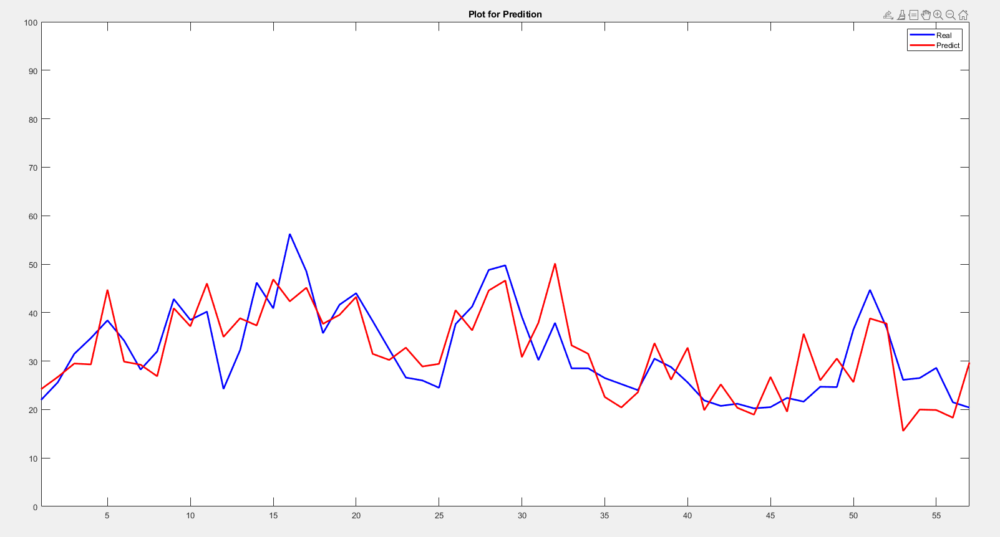

# Simple-Neural-network
Simple Neural network
Function Fitting Neural Network

functions:
 
          adaptFcn: 'adaptwb'
        adaptParam: (none)
          derivFcn: 'defaultderiv'
         divideFcn: 'dividerand'
       divideParam: .trainRatio, .valRatio, .testRatio
        divideMode: 'sample'
           initFcn: 'initlay'
        performFcn: 'mse'
      performParam: .regularization, .normalization
          plotFcns: {'plotperform', 'plottrainstate', 'ploterrhist',
                    'plotregression', 'plotfit'}
        plotParams: {1x5 cell array of 5 params}
          trainFcn: 'trainlm'
        trainParam: .showWindow, .showCommandLine, .show, .epochs,
                    .time, .goal, .min_grad, .max_fail, .mu, .mu_dec,
                    .mu_inc, .mu_max
                    

